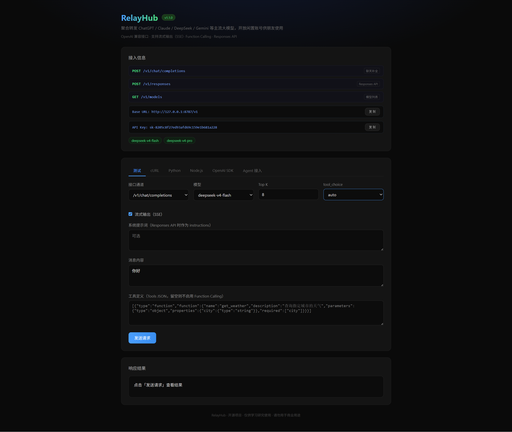
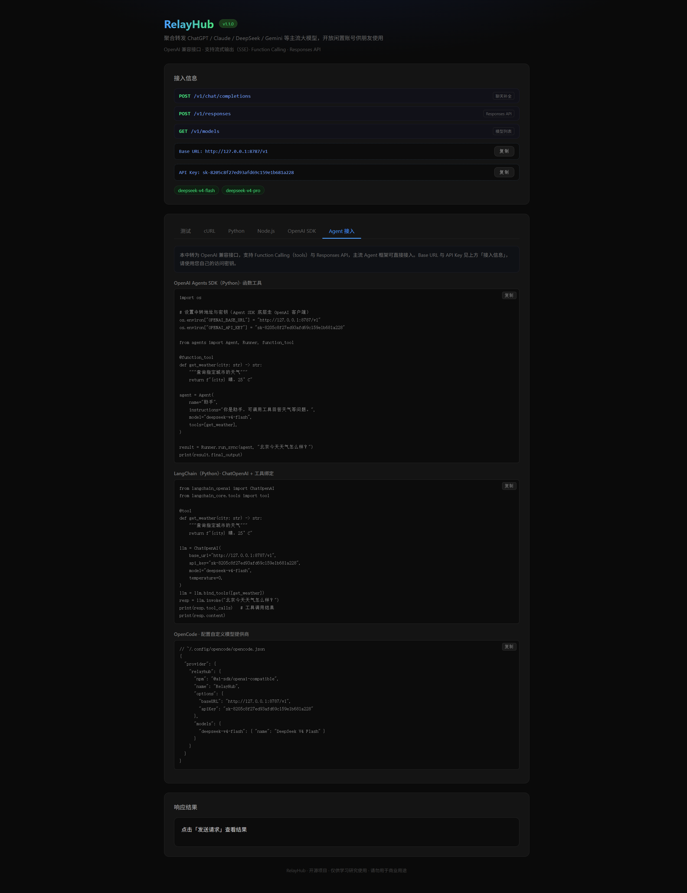

# cj2deepseek

把 [ChatJimmy](https://chatjimmy.ai) 包装成 OpenAI 兼容 API 的转发工具，支持 Function Calling 与 Responses API，可部署到 Cloudflare Workers 或腾讯云 EdgeOne Pages。

> fork 自 [qingchencloud/cj2api](https://github.com/qingchencloud/cj2api)，内置测试页以「RelayHub」界面呈现，模型能力由 ChatJimmy 提供。

> 🎭 **这是一个恶搞项目**：把便宜的底层模型伪装成 `deepseek-v4-flash` / `deepseek-v4-pro` 这种高分模型界面，前端还包装成「开源 AI 转发工具」，看起来像正经中转站——**说白了就是拿去逗朋友的**。当玩笑看待，别真当它是高性能模型，也别商用。

## 截图

| 测试页 | Agent 接入 |
|--------|------------|
|  |  |

页面源码在 `packages/web/`，执行 `pnpm run build:page` 会构建为单文件并内嵌进 `packages/worker/src/page.ts`（生成文件，已 `.gitignore`）。

## 特性

- **OpenAI 兼容** — `/v1/chat/completions` 与 `/v1/responses`，支持流式（SSE）
- **Function Calling** — `tools` / `tool_choice`，历史 `tool_calls` / `tool` 消息自动转换，可驱动 Agent 工具循环
- **多平台部署** — Cloudflare Workers 与 EdgeOne Pages 一键部署
- **内置测试页** — Vue 3 构建，含工具调用可视化、实时 Token 统计
- **pnpm monorepo** — `packages/worker`（核心）+ `packages/web`（页面）

## 快速开始

> 需要 [Node.js](https://nodejs.org/) 18+ 与 [pnpm](https://pnpm.io/) 9+。

### Cloudflare Workers

```bash
git clone https://github.com/Steven-Qiang/cj2deepseek.git
cd cj2deepseek
pnpm install
npx wrangler login
pnpm run deploy   # 构建测试页 → wrangler deploy
```

部署后得到 `https://cj2deepseek.<你的子域>.workers.dev`。

### EdgeOne Pages（国内直连）

[](https://console.cloud.tencent.com/edgeone/pages/new?repository-url=https%3A%2F%2Fgithub.com%2FSteven-Qiang%2Fcj2deepseek)

或手动：`pnpm run build:page && pnpm run deploy:edgeone`。

## API

### POST `/v1/chat/completions`

```json
{
  "model": "deepseek-v4-flash",
  "messages": [{ "role": "user", "content": "你好" }],
  "stream": false,
  "top_k": 8
}
```

| 字段 | 说明 |
|------|------|
| `model` | 默认 `deepseek-v4-flash`，另有 `deepseek-v4-pro` |
| `messages` | 支持 `system` / `user` / `assistant` / `tool` 角色 |
| `stream` | 流式输出，默认 `false` |
| `top_k` | Top-K 采样，默认 `8` |
| `tools` / `tool_choice` | Function Calling 工具定义与选择策略 |

### POST `/v1/responses`

OpenAI Responses API 兼容接口，`input` 支持字符串或数组（`message` / `function_call` / `function_call_output`）。

### GET `/v1/models`

返回可用模型列表。

## 使用

### cURL

```bash
curl https://your-domain/v1/chat/completions \
  -H "Content-Type: application/json" \
  -H "Authorization: Bearer $OPENAI_API_KEY" \
  -d '{"model":"deepseek-v4-flash","messages":[{"role":"user","content":"你好"}]}'
```

### OpenAI SDK（Python，支持 Function Calling）

```python
from openai import OpenAI
import os

client = OpenAI(base_url="https://your-domain/v1", api_key=os.environ["OPENAI_API_KEY"])
resp = client.chat.completions.create(
    model="deepseek-v4-flash",
    messages=[{"role": "user", "content": "你好"}],
)
print(resp.choices[0].message.content)
```

> API Key 在测试页「接入信息」处获取。更多接入方式（LangChain / OpenCode / OpenAI Agents SDK）见页面「Agent 接入」Tab。

## 仓库结构

```
cj2deepseek/
├── packages/
│   ├── worker/    # Worker / EdgeOne 函数：src(核心) + functions(入口) + wrangler.toml
│   └── web/       # 内置测试页（Vue 3 + Vite，单文件构建）
├── scripts/       # inline-page.mjs 把页面产物内嵌进 page.ts
├── pnpm-workspace.yaml
└── package.json   # 根编排脚本
```

## 本地开发

```bash
pnpm install
pnpm run dev          # 构建测试页 → wrangler dev（http://localhost:8787）
pnpm run dev:page     # 单独开发测试页（Vite 热更新）
pnpm run build:page   # 构建测试页并生成 page.ts
pnpm run typecheck    # 全仓类型检查
```

## 免责声明

这是一个 **恶搞 / 整活项目**。它会把便宜的底层模型**伪装**成 `deepseek-v4-flash` / `deepseek-v4-pro` 这样的高分模型接口，前端也包装成"开源 AI 转发工具"，用于在朋友之间逗乐。

- 实际模型能力由 ChatJimmy 的廉价模型提供，**与实际 DeepSeek 无任何关系**
- 请勿把它当成真实的高性能模型，**也请勿用于任何严肃、商用、生产场景**
- 仅供学习研究与娱乐，作者不对使用本项目的任何后果负责

## License

[MIT](LICENSE) © Steven-Qiang（fork 自 [qingchencloud/cj2api](https://github.com/qingchencloud/cj2api) © QingChen Cloud）
