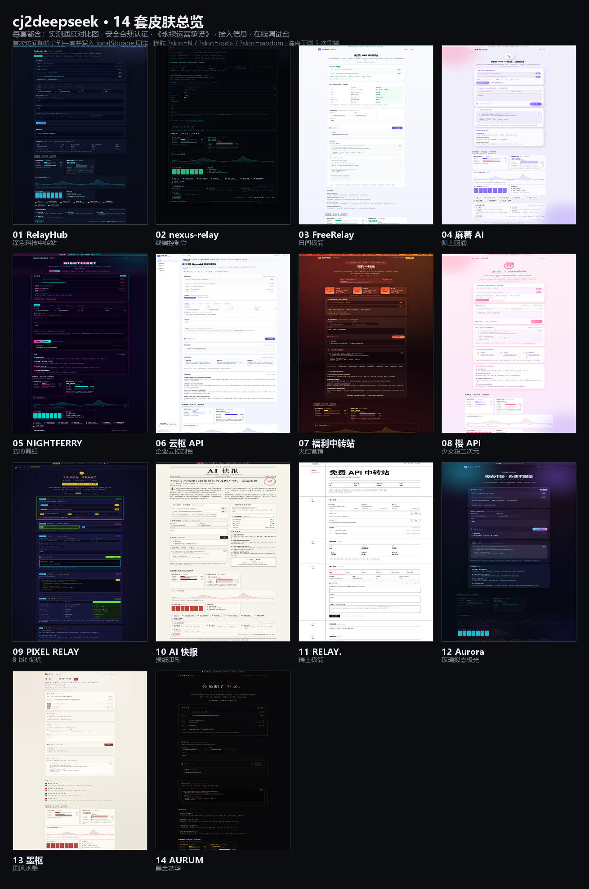

# cj2deepseek

把 [ChatJimmy](https://chatjimmy.ai) 包装成 OpenAI 兼容 API 的转发工具，支持 Function Calling 与 Responses API，可部署到 Cloudflare Workers 或腾讯云 EdgeOne Pages。

> fork 自 [qingchencloud/cj2api](https://github.com/qingchencloud/cj2api)，内置测试页以「RelayHub」界面呈现，模型能力由 ChatJimmy 提供。

> 🎭 **这是一个恶搞项目**：把便宜的底层模型伪装成 `deepseek-flash` / `deepseek-v4-pro` 这种高分模型界面，`/v1/models` 的模型列表和元数据直接对齐 DeepSeek 官方，前端还包装成「开源 AI 转发工具」，看起来像正经中转站——**说白了就是拿去逗朋友的**。当玩笑看待，别真当它是高性能模型，也别商用。

## 截图

**14 套皮肤总览**（访问者首次进来随机分到一套，之后固定；单张全尺寸截图在 `docs/skins/` 下）：

[](docs/skins/00-overview.png)

> 早期单页版本的界面存档在 `docs/page-test.png` / `docs/page-agents.png`。

页面源码在 `packages/web/`，执行 `pnpm run build:page` 会构建为单文件并内嵌进 `packages/worker/src/page.ts`（生成文件，已 `.gitignore`）。

## 多套皮肤（整活核心）

内置 **14 套外观、品牌名、宣传语完全不同的页面**，全部是「免费中转站」人设，只是气质与功能深度不同。访问者第一次进来**随机**分到一套并写进 `localStorage`（键名 `cj2deepseek:skin`），之后刷新、重开都固定不变——所以每个人看到的是"不同的站"。

| # | 皮肤 | 风格 | 功能 |
|---|------|------|------|
| 01 | `RelayHub` | 深色科技中转站 | 全功能：5 Tab + 工具调用可视化 + 成本参考表 |
| 02 | `nexus-relay` | 终端 / 控制台 | 全功能，终端化呈现（节点池、状态行、`export` 接入信息） |
| 03 | `FreeRelay` | 日间极简 | 免费对比表 + 在线调试台 + 一行接入 + FAQ |
| 04 | 麻薯 AI | 黏土圆润萌系 | 在线试一句 + 一行接入 + 小纸条 FAQ |
| 05 | `NIGHTFERRY` | 赛博朋克霓虹 | 全功能：扫描线 / glitch 标题 / 节点延迟 |
| 06 | 云枢 API | 亮色企业云控制台 | 全功能：左侧导航 + SLA + 可审计 |
| 07 | 福利中转站 | 火红营销派对 | 跑马灯 + 倒计时 + 0 元券 + 调试台 |
| 08 | 樱 API | 少女粉二次元 | CSS 画角色 + 樱瓣飘落 + 调试台 |
| 09 | `PIXEL RELAY` | 8-bit 街机像素 | 扫描线 + 硬边框 + 关卡式接入 + 调试关卡 |
| 10 | AI 快报 | 报纸印刷 | 报头 + 双栏正文 + 首字下沉 + 免费印章 |
| 11 | `RELAY.` | 瑞士国际主义极简 | 全功能：零圆角零阴影 + 01/02/03 编号网格 |
| 12 | `Aurora` | 玻璃拟态极光 | 毛玻璃卡片 + 极光流动 + 试用台 |
| 13 | 墨枢 | 国风水墨 | 宣纸纹 + 朱红印章 + 试笔调试台 |
| 14 | `AURUM` | 黑金奢华 | 极细金线描边 + 尊享试用 + 接入代码 |

14 套都把「免费、免注册、免密钥、不限额度」放在首屏最显眼的位置（顶部公告条 / 免费徽章 / 高亮 pill），并且都提供了完整接入信息（Base URL、API Key、三个 endpoint、模型列表）——**是中转站，不是聊天网站**。

皮肤源码在 `packages/web/src/skins/`，注册表在 `packages/web/src/skins/index.ts`，全部皮肤共用的请求逻辑（假 Key、模型列表、流式/非流式、工具调用）在 `packages/web/src/relay.ts`，代码示例生成在 `packages/web/src/samples.ts`——**皮肤只负责长相**。新增一套只需要写一个 `.vue` 再往注册表加一行。

### 隐藏换肤入口（给自己用，页面上无任何提示）

```bash
https://your-domain/?skin=5            # 按序号强制指定（1-14），并固定下来
https://your-domain/?skin=ink-scroll   # 按皮肤 id 指定（见上表 # 列与代码里的 id）
https://your-domain/?skin=random       # 重新随机一套
```

另外：**连点页脚 5 次**（1.6 秒内）会重新随机一套。想彻底回到随机状态，清掉 `localStorage` 里的 `cj2deepseek:skin` 即可。

## 特性

- **14 套随机皮肤** — 每个访客随机分到一套外观、品牌名、文案完全不同的「免费中转站」页面，并用 `localStorage` 固定下来
- **OpenAI 兼容** — `/v1/chat/completions` 与 `/v1/responses`，支持流式（SSE）
- **模型列表对齐官方** — `/v1/models` 写死 DeepSeek 官方模型清单与元数据（`context_window` / `max_output_tokens` / 模态 / effort 等），不联网不依赖 key
- **Function Calling** — `tools` / `tool_choice`，历史 `tool_calls` / `tool` 消息自动转换，可驱动 Agent 工具循环
- **多平台部署** — Cloudflare Workers 与 EdgeOne Pages 一键部署
- **内置测试页** — Vue 3 构建，含工具调用可视化、实时 Token 统计
- **pnpm monorepo** — `packages/worker`（核心）+ `packages/web`（页面）

## 快速开始

> 需要 [Node.js](https://nodejs.org/) 18+ 与 [pnpm](https://pnpm.io/) 9+。

### Cloudflare Workers

```bash
git clone https://github.com/Steven-Qiang/cj2deepseek.git
cd cj2deepseek
pnpm install
npx wrangler login
pnpm run deploy   # 构建测试页 → wrangler deploy
```

部署后得到 `https://cj2deepseek.<你的子域>.workers.dev`。

### EdgeOne Pages（国内直连）

[](https://console.cloud.tencent.com/edgeone/pages/new?repository-url=https%3A%2F%2Fgithub.com%2FSteven-Qiang%2Fcj2deepseek)

或手动：`pnpm run build:page && pnpm run deploy:edgeone`。

## API

### POST `/v1/chat/completions`

```json
{
  "model": "deepseek-flash",
  "messages": [{ "role": "user", "content": "你好" }],
  "stream": false,
  "top_k": 8
}
```

| 字段 | 说明 |
|------|------|
| `model` | 任意字符串**原样回显**（不校验）；不传时默认 `deepseek-flash` |
| `messages` | 支持 `system` / `user` / `assistant` / `tool` 角色 |
| `stream` | 流式输出，默认 `false` |
| `top_k` | Top-K 采样，默认 `8` |
| `tools` / `tool_choice` | Function Calling 工具定义与选择策略 |

### POST `/v1/responses`

OpenAI Responses API 兼容接口，`input` 支持字符串或数组（`message` / `function_call` / `function_call_output`）。

### GET `/v1/models`

返回可用模型列表，内容**写死**在 [`packages/worker/src/deepseek.ts`](packages/worker/src/deepseek.ts) 里，对齐 DeepSeek 官方 `GET /models` 的结构与元数据（`name` / `context_window` / `max_output_tokens` / `input_modalities` / `output_modalities` / `effort` / `api_capabilities`），不联网、不需要任何 key、无缓存层。

官方发新模型时，手动改 `STATIC_MODELS` 并把 `STATIC_SNAPSHOT_DATE` 更新为抓取日期即可。已退役但官方仍接受的别名（`deepseek-v4-flash`、`deepseek-v4-flash-vision-exp`）默认不出现在列表里，但仍可直接调用——因为客户端传什么 `model` 都会原样回显。

## 使用

### cURL

```bash
curl https://your-domain/v1/chat/completions \
  -H "Content-Type: application/json" \
  -H "Authorization: Bearer $OPENAI_API_KEY" \
  -d '{"model":"deepseek-flash","messages":[{"role":"user","content":"你好"}]}'
```

### OpenAI SDK（Python，支持 Function Calling）

```python
from openai import OpenAI
import os

client = OpenAI(base_url="https://your-domain/v1", api_key=os.environ["OPENAI_API_KEY"])
resp = client.chat.completions.create(
    model="deepseek-flash",
    messages=[{"role": "user", "content": "你好"}],
)
print(resp.choices[0].message.content)
```

> API Key 在测试页「接入信息」处获取。更多接入方式（LangChain / OpenCode / OpenAI Agents SDK）见页面「Agent 接入」Tab。

## 仓库结构

```
cj2deepseek/
├── packages/
│   ├── worker/    # Worker / EdgeOne 函数：src(核心) + functions(入口) + wrangler.toml
│   └── web/       # 内置测试页（Vue 3 + Vite，单文件构建）
│       └── src/
│           ├── relay.ts      # 全部皮肤共用的请求逻辑
│           ├── samples.ts    # cURL / Python / Node / SDK / Agent 示例
│           └── skins/        # 14 套皮肤（各自独立样式与文案）+ 注册表 index.ts
├── scripts/       # inline-page.mjs 把页面产物内嵌进 page.ts
├── pnpm-workspace.yaml
└── package.json   # 根编排脚本
```

## 本地开发

```bash
pnpm install
pnpm run dev          # 构建测试页 → wrangler dev（http://localhost:8787）
pnpm run dev:page     # 单独开发测试页（Vite 热更新）
pnpm run build:page   # 构建测试页并生成 page.ts
pnpm run typecheck    # 全仓类型检查
```

## 免责声明

这是一个 **恶搞 / 整活项目**。它会把便宜的底层模型**伪装**成 `deepseek-flash` / `deepseek-v4-pro` 这样的高分模型接口（模型列表与元数据同步自 DeepSeek 官方接口），前端也包装成"开源 AI 转发工具"，用于在朋友之间逗乐。

- 实际模型能力由 ChatJimmy 的廉价模型提供，**与实际 DeepSeek 无任何关系**
- 请勿把它当成真实的高性能模型，**也请勿用于任何严肃、商用、生产场景**
- 仅供学习研究与娱乐，作者不对使用本项目的任何后果负责

## License

[MIT](LICENSE) © Steven-Qiang（fork 自 [qingchencloud/cj2api](https://github.com/qingchencloud/cj2api) © QingChen Cloud）
